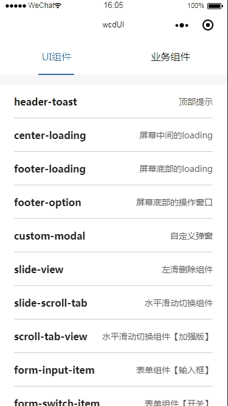

# 组件库
小程序公共组件

## 效果图

# 目录
- [header-toast 顶部提示](./#user-content-header-toast组件)
- [center-loading 屏幕中间的loading](./#user-content-center-loading组件)
- [footer-loading 底部的加载loading](./#user-content-footer-loading组件)
- [footer-option 底部的操作窗口](./#user-content-footer-option组件)
- [custom-modal 自定义弹窗](./#user-content-custom-modal组件)
- [slide-view 左滑删除组件](./#user-content-slide-view组件)
- [slide-scroll-tab 水平滑动切换页面](./#user-content-slide-scroll-tab组件)
- [scroll-tab-view 水平滑动切换【加强版】](./#user-content-scroll-tab-view组件)
- [form-input-item 表单组件【输入框】](./#user-content-form-input-item组件)
- [form-switch-item 表单组件【开关】](./#user-content-form-switch-item组件)
- [form-options-item 表单组件【添加选项】](./#user-content-form-options-item组件)
- [form-counter-item 表单组件【计数器】](./#user-content-form-counter-item组件)

## header-toast组件
### 描述
位于顶部的提示，提示之后延迟1600ms自动消失

### 定义字段
| 字段 | 类型 | 是否必填 | 默认值 | 描述 |
| :------: | :------: | :------: | :-----:| :------: |
| isShow | Boolean | 否 | false | 是否显示 |
| title | String | 否 | '' | 提示内容 |

## center-loading组件
### 描述
屏幕中间的loading

### 定义字段
无定义字段，使用wx:if控制显隐

## footer-loading组件
### 描述
位于屏幕底部的加载loading，主要用于滚动加载

### 定义字段
| 字段 | 类型 | 是否必填 | 默认值 | 描述 |
| :------: | :------: | :------: | :-----:| :------: |
| isShow | Boolean | 否 | false | 是否显示 |
| isBottomTip | Boolean | 否 | false | 到底部是否显示提示 |

## footer-option组件
### 描述
位于屏幕底部，从底部向上弹出的窗口

### 定义字段
| 字段 | 类型 | 是否必填 | 默认值 | 描述 |
| :------: | :------: | :------: | :-----:| :------: |
| isShow | Boolean | 否 | false | 是否显示 |

### slot插槽
| slot | 描述 |
| :---: | :---: |
| header| 窗口头部的内容， 例如添加组件|
| middle| 窗口中间的内容，例如操作选项|
| footer| 窗口的底部内容，例如取消操作|

## custom-modal组件
### 描述
样式自定义弹窗

### 定义字段
| 字段 | 类型 | 是否必填 | 默认值 | 描述 |
| :------: | :------: | :------: | :-----:| :------: |
| isShow | Boolean | 否 | false | 是否显示 |
| padding | String | 否 | '0rpx' | 弹窗内容区域的padding |
| footerStyle | String | 否 | '' | 弹窗底部的样式 |

### slot插槽
| slot | 描述 |
| :---: | :---: |
| modal-header| 窗口头部的内容|
| modal-content| 窗口中间的内容，例如是否取消订单|
| cancel-btn| 窗口的底部左边的按钮，例如取消按钮 |
| confirm-btn| 窗口的底部右边的按钮，例如确认按钮 |

### 绑定事件
| 键值 | 触发时机 |
| :---: | :---: |
| bindcancelEvent| 点击底部左边的按钮触发 |
| bindconfirmEvent | 点击底部右边的按钮触发 |

## slide-view组件
### 描述
左滑删除组件。
- 官方也有这个组件，不过小程序基础库 2.2.1 以上版本，微传单小程序的基础库版本为2.1.0。
- [官方slide-view代码地址](https://github.com/wechat-miniprogram/slide-view)

### 定义字段
| 字段 | 类型 | 是否必填 | 默认值 | 描述 |
| :------: | :------: | :------: | :-----:| :------: |
| optionWidth | String | 否 | '110rpx' | 右侧隐藏按钮的宽度 |
| isClose | Boolean | 否 | false | 是否关闭左滑。当value为true时，右滑返回正常位置 |

### slot插槽
| slot | 描述 |
| :---: | :---: |
| content| 不左滑时显示的内容 |
| option| 隐藏的选项，左滑后显示 |

### 绑定事件
| 键值 | 触发时机 |
| :---: | :---: |
| bindclickEvent| 点击slot为content的区域时触发 |

## slide-scroll-tab组件
### 描述
水平滑动切换页面

### 定义字段
| 字段 | 类型 | 是否必填 | 默认值 | 描述 |
| :------: | :------: | :------: | :-----:| :------: |
| tabs | Array | 是 | 无 | 顶部的tab选项 |

### slot插槽
| slot | 描述 |
| :---: | :---: |
| tab-content-0 | 第一个页面 |
| tab-content-1 | 第二个页面 |
| ... | ... |
| tab-content-{index} | 第n个页面 |

## scroll-tab-view组件
### 描述
水平滑动切换页面组件【加强版】。
- 顶部tab可以滚动，而且还有二级tab，支持滚动加载。
- 每个切换的页面都记录了当前页面的一级分类tab的index、二级分类的tab的index、当前页面数据的页数scrollPage。
- 可以判断是否需要重新加载数据。当一级分类tab的index、二级分类的tab的index与之前的旧数据不同时，isReload会变为true，通过触发switchEvent传播到父组件，从而使父组件重新发请求去获取数据。

### 定义字段
| 字段 | 类型 | 是否必填 | 默认值 | 描述 |
| :------: | :------: | :------: | :-----:| :------: |
| firstTab | Array | 是 | 无 | 一级分类。item.name为tab的名字 |
| secondTab | Array | 否 | 无 | 二级分类。item.name为tab的名字 |
| firstTabTitle | String | 否 | 无 | 一级分类的标题描述 |
| secondTabTitle | String | 否 | 无 | 二级分类的标题描述 |

### slot插槽
| slot | 描述 |
| :---: | :---: |
| tab-content-0 | 第一个页面 |
| tab-content-1 | 第二个页面 |
| ... | ... |
| tab-content-{index} | 第n个页面 |

### 绑定的事件
| 键值 | 触发时机 | 携带对象 |
| :---: | :---: | :----: |
| bindswitchEvent| 切换页面的时候触发 | e.detail |

### e.detail对象
| 字段 | 描述 |
|:--: | :--:|
| firstTabIndex | 一级分类tab的index |
| secondTabIndex | 二级分类tab的index |
| firstTabObj | 一级分类数组的当前元素 |
| secondTabObj | 二级分类的数组元素 |
| scrollPage | 当前页面滚动加载的页数 |
| isReLoad | 是否需要重新获取当前页面的数据。当secondTabIndex与旧数据不同时，为true|

## form-input-item组件
### 描述
表单的input组件

### 定义字段
| 字段 | 类型 | 是否必填 | 默认值 | 描述 |
| :------: | :------: | :------: | :-----:| :------: |
| tabName | String | 是 | 无 | 左边的文字描述 |
| value | String | 是 | 无 | 输入框的默认值 |
| placeholder | String | 否 | 无 | 输入框的placeholder |
| adjustPos | Boolean | 否 | false | 输入时是否上移页面 |
| marginTop | String | 否 | 无 | margin-top样式 |
| height | String | 否 | 110rpx | 高度 |
| hasBottomBorder | Boolean | 否 | false | 是否有下边框 |

### 绑定的事件
| 键值 | 触发时机 | 携带对象 |
| :---: | :---: | :----: |
| bindinputChange| 输入框blur | e.detail.value |

## form-switch-item组件
### 描述
表单的开关组件

### 定义字段
| 字段 | 类型 | 是否必填 | 默认值 | 描述 |
| :------: | :------: | :------: | :-----:| :------: |
| tabName | String | 是 | 无 | 左边的文字描述 |
| switchCheck | Boolean | 是 | true | 开关的默认状态 |
| marginTop | String | 否 | 无 | margin-top样式 |
| height | String | 否 | 110rpx | 高度 |
| hasBottomBorder | Boolean | 否 | false | 是否有下边框 |

### 绑定的事件
| 键值 | 触发时机 | 携带对象 |
| :---: | :---: | :----: |
| bindswitchChange| 点击整个tab | e.detail.value |

## form-options-item组件
### 描述
添加选项、删除选项

### 定义字段
| 字段 | 类型 | 是否必填 | 默认值 | 描述 |
| :------: | :------: | :------: | :-----:| :------: |
| tabName | String | 是 | 无 | 左边的文字描述 |
| marginTop | String | 否 | 无 | margin-top样式 |
| height | String | 否 | 110rpx | 高度 |
| hasBottomBorder | Boolean | 否 | false | 是否有下边框 |
| hasTopBorder | Boolean | 否 | false | 是否有上边框 |

### slot插槽
| slot | 描述 |
| :---: | :---: |
| left | 左边的自定义插槽 |
| right | 右边的自定义插槽 |

## form-counter-item组件
### 描述
计数器表单组件

### 定义字段
| 字段 | 类型 | 是否必填 | 默认值 | 描述 |
| :------: | :------: | :------: | :-----:| :------: |
| tabName | String | 是 | 无 | 左边的文字描述 |
| times | Number | 是 | 无 | 计数器默认值 |
| counterUnit | String | 否 | 无 | 计数器默认单位 |
| minTime | Number | 否 | 0 | 计数器最小值 |
| maxTime | Number | 否 | 100000 | 计数器最大值 |
| marginTop | String | 否 | 无 | margin-top样式 |
| height | String | 否 | 110rpx | 高度 |
| hasBottomBorder | Boolean | 否 | false | 是否有下边框 |

### 绑定的事件
| 键值 | 触发时机 | 携带对象 |
| :---: | :---: | :----: |
| bindcounterChange| 点击整个tab | e.detail.value |

